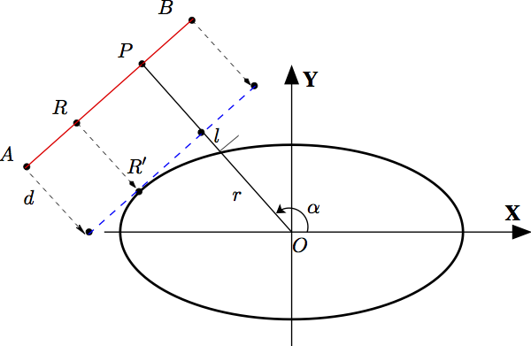

Similarly to the definition of the distance of closest approach (DCA) for two arbitrary [ellipses][^1] 
we define the DCA for an arbitrary ellipse and a line segment. 

The quantity we are looking for is \(l\) with:

$$l = \parallel \vec{OP} \parallel − r − d$$

[^1]: X. Zheng and P. Palffy-Muhoray. Distance of closest approach of two arbitrary hard ellipses in two dimensions. Phys. Rev. E 75:061709, 2007
