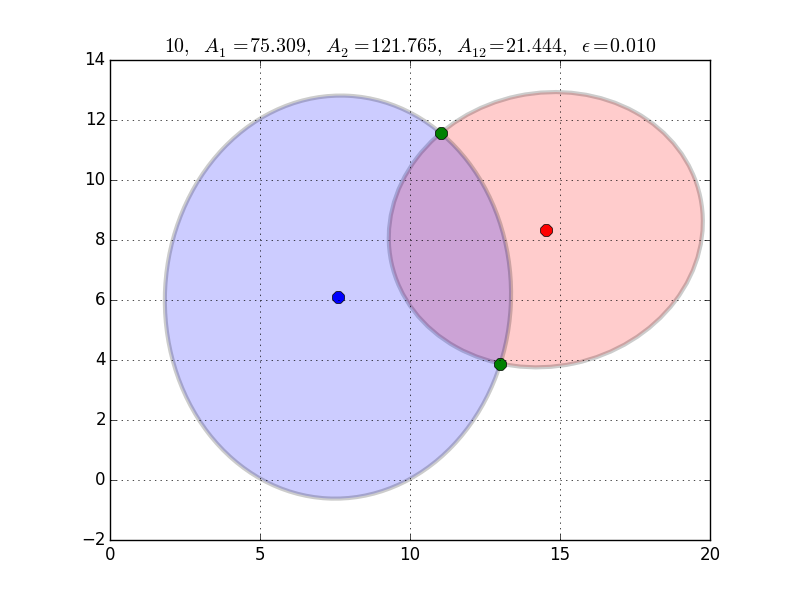

This is a general algorithm for finding the overlap area between two ellipses.

The algorithm is based on finding a segment area (the area between an ellipse and a secant line) 
given two points on the ellipse.  
The Gauss-Green formula is used to determine the ellipse sector area between two points, 
and a triangular area is added or subtracted to give the segment area.  

For two ellipses, overlap area is calculated by adding the areas of appropriate sectors and polygons.  
Intersection points for two general ellipses are found using Ferrari's quartic formula to solve the polynomial that results from combining the two ellipse equations.  
All cases for the number of intersection points (0, 1, 2, 3, 4) are handled.  

The algorithm is implemented in c-code, and has been tested with a range of input ellipses (with some open issues ^_^).     

- More details can be found in the  [paper](http://link.springer.com/article/10.1007%2Fs00791-013-0214-3). See also the available [preprint](http://arxiv.org/abs/1106.3787). 

- The implementation of the code can be found on [GitHub](https://github.com/chraibi/EEOver).
