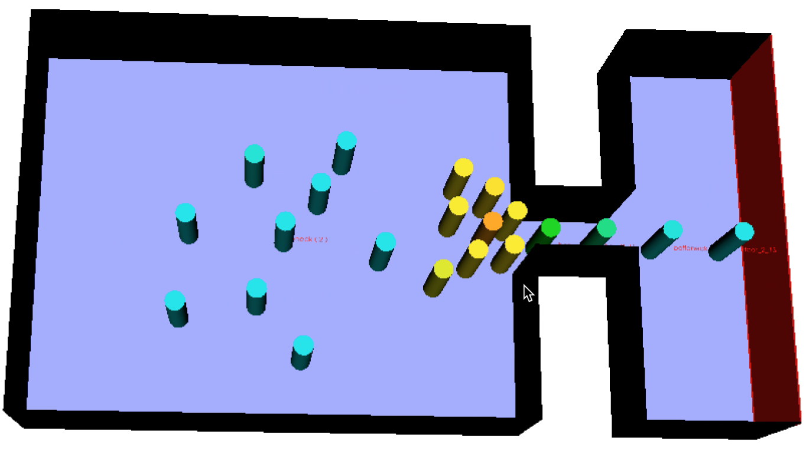

In this tutorial we will see how to use [JuPedSim](http://www.jupedsim.org). 

**Note**

- I will focus only on `jpscore` (simulation module).
- Besides, I will take the example of `CLion`.
- You can *see* this tutorial on [YouTube](https://www.youtube.com/watch?v=Achsd2EpJbI).

**Get the code of `jpscore`** 

- Download the code from the [repository](https://github.com/jupedsim/jpscore)
  (`git clone`)

- Once the download is finished, change to the directory of the code.

- The git branch will be by default `develop` (write `git status` to check). 

**Create a project**

If you don't have `CLion` yet, you can get it from [here](https://www.jetbrains.com/clion/specials/clion/clion.html?&utm_source=bing&utm_medium=cpc&utm_campaign=EMEA_en_DE_Clion_Branded&utm_term=Clion&utm_content=Clion_branded_&gclid=CMnM1Yn--s8CFU_LGQod-CkMZQ&gclsrc=ds&dclid=CNfj14n--s8CFUepUQodSesITQ).
It is free for students and open-source projects.

- Open `CLion`.
- Open a project. The "project file" in our case is the file `CMakelists.txt`. 
  `CLion` will read it, and then index the whole project. This may take some time.
  (this initialization process takes place only for the first setup of the project.)
- Start building the project --> click on `Build`. 
  
- `jpscore` has quit a lot of source files. Therefore, the compilation of the whole project takes some time (patience T__T)
- In the directory inputfiles as well as in demos you can find some `inifiles` to start with. 
- You can edit the inifile to have more control over the simulation. The result of the simulation is in the file trajectories.xml. Make sure to read the online documentation [here](http://www.jupedsim.org/jpscore_introduction.html). 

**Visualization of the results** 

- Open `jpsvis`[^1] and visualize the trajectory-file.
- Next time I will show how to work with `jpsvis`. 

**Questions** 

- Questions? Problems? Open an issue using [GitLab issue tracker](https://github.com/jupedsim/jpscore/issues). 

[^1]: `jpsvis` comes with an executable for Windows and a `dmg-file` for Mac OS X.
