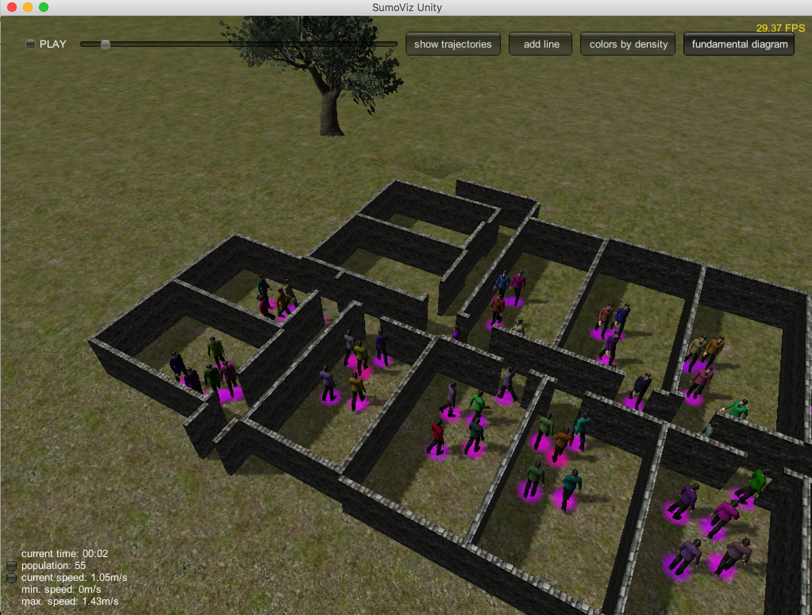

<script src="https://cdn.mathjax.org/mathjax/latest/MathJax.js?config=TeX-AMS-MML_HTMLorMML" type="text/javascript"></script>

 Someone sent me a link to a nice project Daniel Buechele.
 It is called [SumoViz3D](https://github.com/danielbuechele/SumoViz3D):  
`a WebGL-based post-visualization of pedestrian simulation data.` 
 
 
 Although it seems the project is not actively developed, however it is still very easy to use and has some nice features
 like:
 
 - coloring pedestrians with respect to density or speed.
 - drawing a measurement line to measure (on the fly) the flow. 
 - drawing an instantaneous Fundamental Diagram (\\(\rho, v\\)).
 - show the trajectories of pedestrians.
 - live plots of different statistics e.g. (\\(N, t\\))-curve or (\\(v, t\\))-curve.

[Here](https://vimeo.com/100908789) a nice demo on Vimeo (German speaker but whatever).

Well now, would it not be great to use this fantastic project to visualize simulations created by `JuPedSim`?

`SumoViz3D` needs two different file: 

- a geometry file (called `geometry.txt`) 
- and a trajectory file called `b090_combined.txt`.

I'm sure the names can be changed, but as I said before, the code is not actively developed. So, for the time being
 let's just don't care. 
 
What we need is a parser to convert `JuPedSim`'s files in `SumoVis3D` required formats, move the 
produced files in the directory where `SumoVis3D` lives and fire it up:

```bash
# call the parser 
python3 scripts/vizUnity_geometry.py jupedsim_geometry.xml jupedsim_trajectory.xml

# mv the files to SumoVis directory
mv geometry.txt b090_combined.txt ~/SumoVizUnity

# run SumoViz
./SumoViz\ Unity.app/Contents/MacOS/SumoViz\ Unity SumoViz\ Unity
```

That is it. 




**Control the vizualisation**

I found these keystrokes helpful to control the scene: 

- `esc` rotate the scene with the mouse
- `w` and `s` zoom in and out
- `a` and `d` move left and right
- `q` and `e` go up and down

**Python script** 

Get the script from the `jpscore `[repository](https://cst.version.fz-juelich.de/jupedsim/jpscore/blob/develop/scripts/vizUnity_geometry.py) 

Enjoy!


